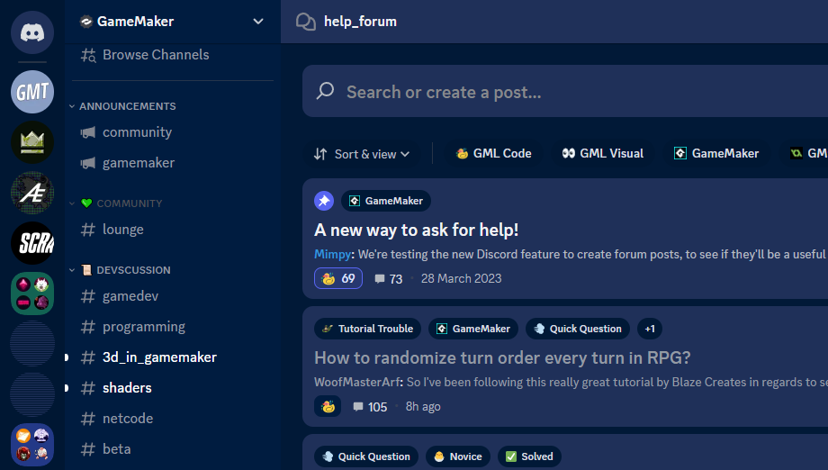
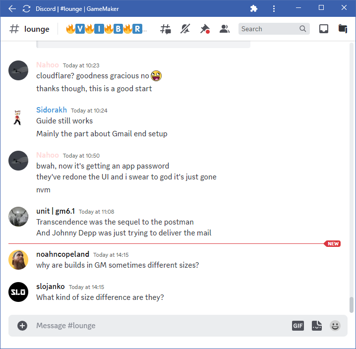
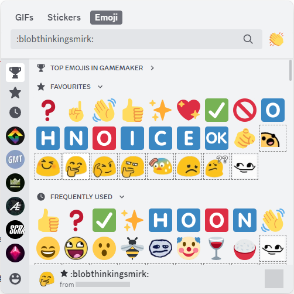
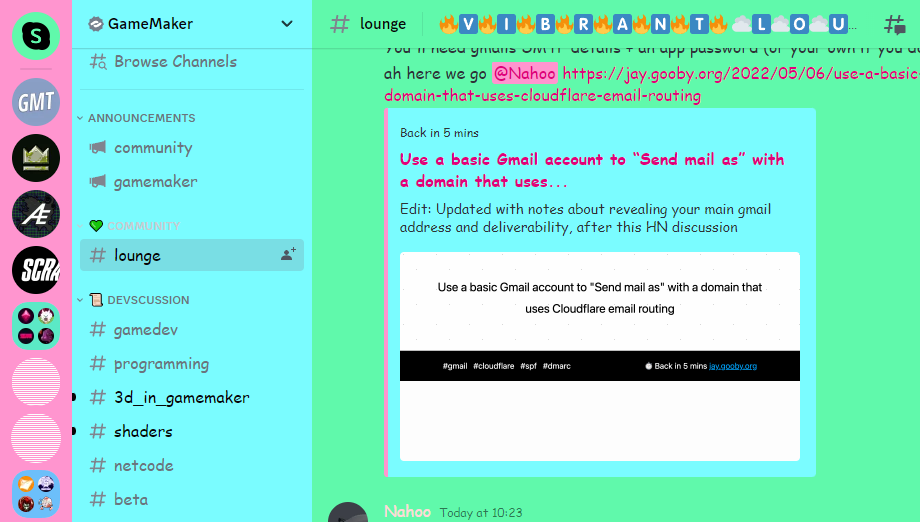

# Discord tweaks

Rest assured, you have to use the web version of Discord for most of these.

## [Discord Dark Blue](discord-dark-blue.user.css)

Changes some tones of the default dark theme to be a slightly lighter blue tone, particularly the input fields.

At some point I got tired of tweaking this and went back to using the light theme.

## [Discord Extensions](discord-extensions.user.css)

A configurable userstyle with a handful of small things:

- Add padding on the bottom of the chat area (so that you can still see who's typing while mouseovering an image/link in Chromium and Firefox)
- Hide some of the ever-growing number of buttons that cause a "BUY NITRO NOW" popup
- Hide the less-common ("mark unread", TTS) items in the message context menus
- Show full-size emoji images when clicking on them in a message.

## ["compact" checkbox](discord-compact-checkbox.user.js) (js)

Replaces the "Help" button with a button to collapse the server list and channel list areas.

A somewhat reasonable way to keep track of two or three conversations at once (by opening additional tabs/windows with Discord Web).

## [Copy Emoji URL](discord-copy-emoji-url.user.js) (js)

Clicking on an inaccessible
(e.g. because you don't have Nitro and it's from a different server)
emoji now copies its URL instead. Such emojis are marked in the picker with a dashed outline.

## [Tray icon](https://github.com/YAL-Tools/TrayIconForDiscordWeb) (js, Windows)

A userscript + app combination to give Discord Web a tray icon the same way the native app has it.

## [Discord Comedy](discord-comedy.css)

If I show people a screenshot and they start complaining about the light theme, I send them an updated screenshot with this applied.

