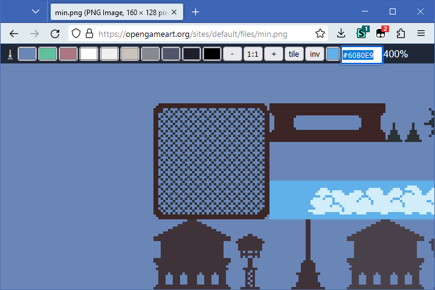

# [IMGXIS](IMGXIS.user.js) (js)
  

Adds a bunch of controls when opening images in a separate tab:

- Map widget-like pan/zoom  
  (click to pan, mouse wheel to zoom while keeping the cursor on the same spot)
- Nearest-neighbour scaling when at >100% zoom
- Customizable background colors
- Tiled preview
- Inverted preview
- A color picker  
  (hold Ctrl and press C to copy the hex color)
