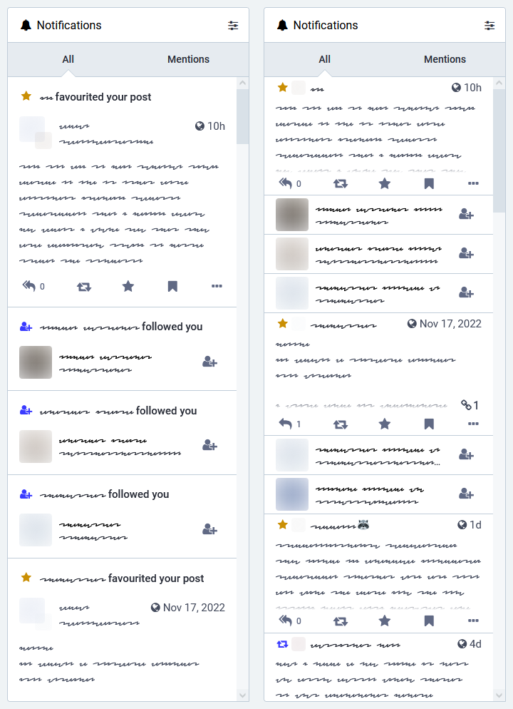

# Compact Notifications

**Links:** [userstyles.world](https://userstyles.world/style/7405/mastodon-compact-notifications)

Compresses Mastodon notifications slightly:

- Currently follow/boost/favourite notifications are affected
- Top/bottom padding is decreased
- Follow notifications are compressed into a single block (user icon + " followed you")
- Favourite/boost notification content is capped at a configurable height (prevents notifications for long toots from taking up too much space)
- Collapses attachment list into a clickable counter (configurable)
- Optionally collapses favourite/boost headers (you already know that the action applies to your account, don't you?)
- Works with both default and advanced interfaces
- All of these changes are undone when a notification has focus (either through keyboard or by clicking on a non-interactive part of it)

You'll want to edit the userstyle to specify your domains of interest.

Known issues:

- Scrolling back up can get slightly wobbly as Mastodon estimates notification heights without this style in mind.

