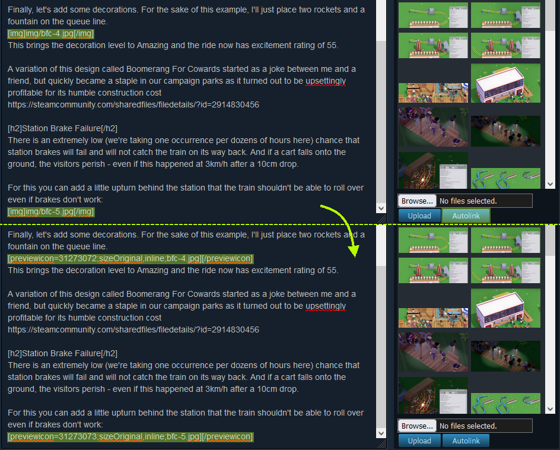
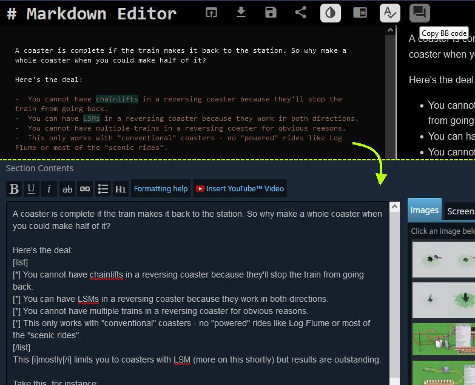
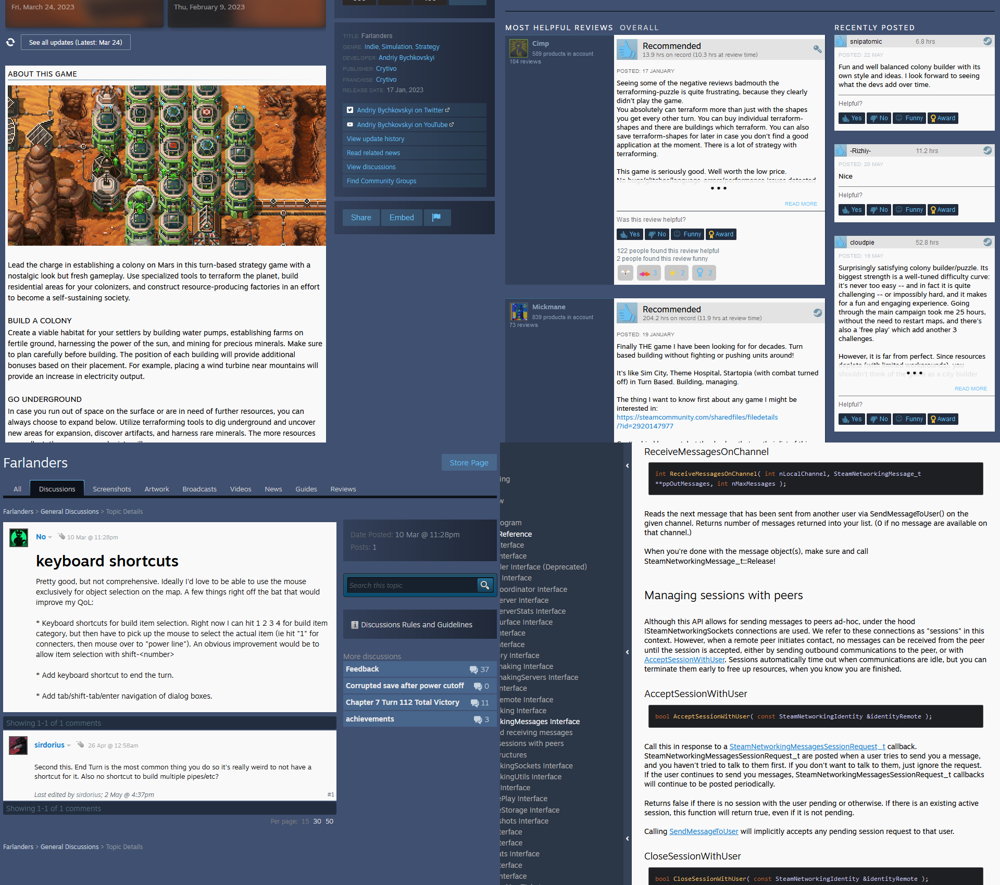

# Steam things

## [Auto-link guide images](steam-guide-image-auto-link.user.js) (js)



Adds an "autolink" button to the Images section that looks for image tags in one of the following formats:
```
[[File:some.png]]

[img]some.png[/img]
```
and automatically replaces them with a Steam guide image tag (`[previewicon=ID;sizeOriginal,inline;some.png][/previewicon]`) if there's a same-named image on the list.

## [Markdown to Steam BB Code](markdown-to-steam-bbcode.user.js) (js)



Adds a button to jbt's Markdown Editor to copy Steam-compatible BB code.

Can be used in conjunction with above to write a guide locally and then upload images, convert sections, and auto-link images in place.

## [Steam Light\[-ish\]](steam-light.user.css)



Changes text-heavy parts of the website to be black-on-white and changes the background color to a slightly-lighter shade of blue.