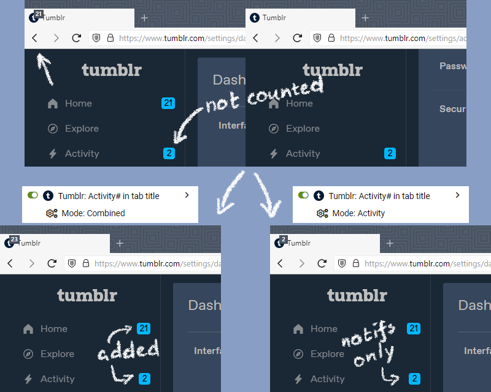

# Tumblr tweaks

## [Activity count in tab title](tumblr-activity-in-title.user.js)

Have you ever noticed that on web, Tumblr shows the number of unread posts in the tab title, but doesn't include Activity in that number?

This userscript fixes that. It also has an option to show _only_ the unread notification count in the tab title, which might be useful if you always have unreads in Home anyway.

Mode is toggled in the userscripts menu.