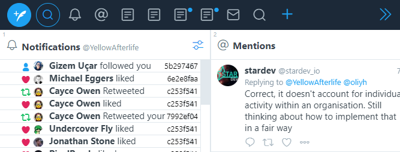
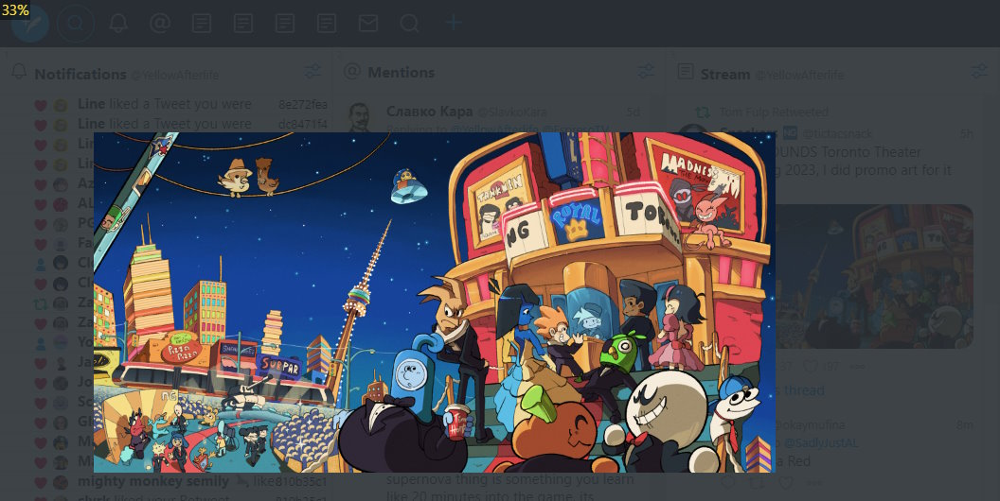
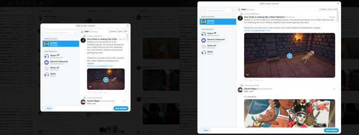
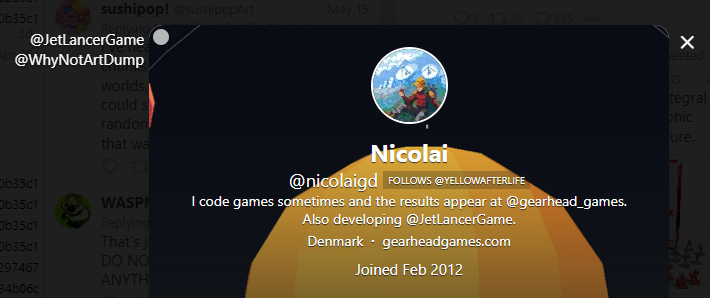

# TweetDeck things

Remember when Twitter used to have a usable frontend? None of this works anymore.

### [Horizontal menu](tweetdeck-horizontal-menu.user.css)

Moves the menu (with Tweet button, search, and your columns) to the top of the page when in collapsed mode.

### [Lightboxes](tweetdeck-lightboxes.user.js) (js)

Shows a pannable, zoomable lightbox when clicking on images, GIFs, profile avatars, and profile backgrounds. Can be middle-clicked to invert the image.

### [Bigger modals](tweetdeck-bigger-modals.user.css)

Stretches profile modal windows to be wider and cover window height.

Particularly handy for viewing at >1080p and/or vertical displays.

### [Modal history](tweetdeck-modal-history.user.js) (js)

When navigating to a user profile by clicking a `@handle` in another user's profile modal,
previous location will be displayed on the left of the profile modal (only in summary view).