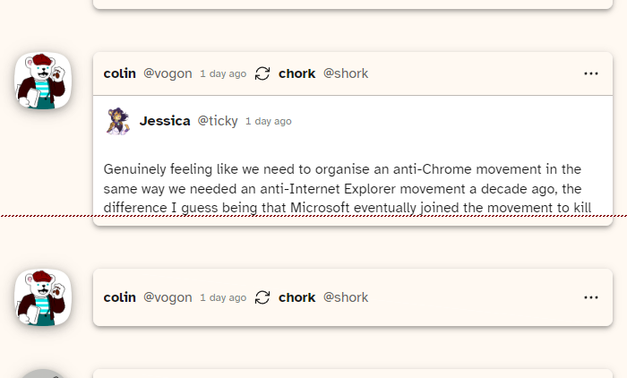

## [Collapsible posts](cohost-collapsible-posts.user.js) (js)

Have you read this one already? Not too interested in takes on today's website drama? Got tricked into expanding a 10K-pixel-tall post again? Well good news, you can now click on an empty spot in post headers (the yellow-ish area showing author and date) to collapse a post. And if you change your mind, click it again and it'll expand back.