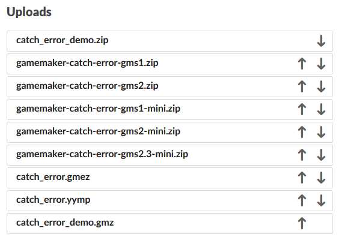

# itch.io things

## [Grid layout on dashboard](itch-dashboard-grid.user.css)

Changes the dashboard project list to a Collection-like view that fits window width.

## [HDPI icons on dashboard](itch-dashboard-hdpi.user.js) (js)

Recommended for above - loads the higher-resolution thumbnails instead of the default little ones.

## [Compact upload list](itch-compact-upload-list.user.css)

Compresses the uploads list on project editing page a little.

## [Upload list orderer](itch-project-uploads-orderer.user.css)

If you have a project with a handful of uploads, you might have noticed that ordering these isn't so nice - you have "move up" / "move down" links in each upload's box, but you can only fit so many of these on the screen at once, so it's scrolling and clicking.

This userstyle removes entirety of the upload UI, leaving only file names and move up/move down buttons. Something that you enable, order things, and then disable.